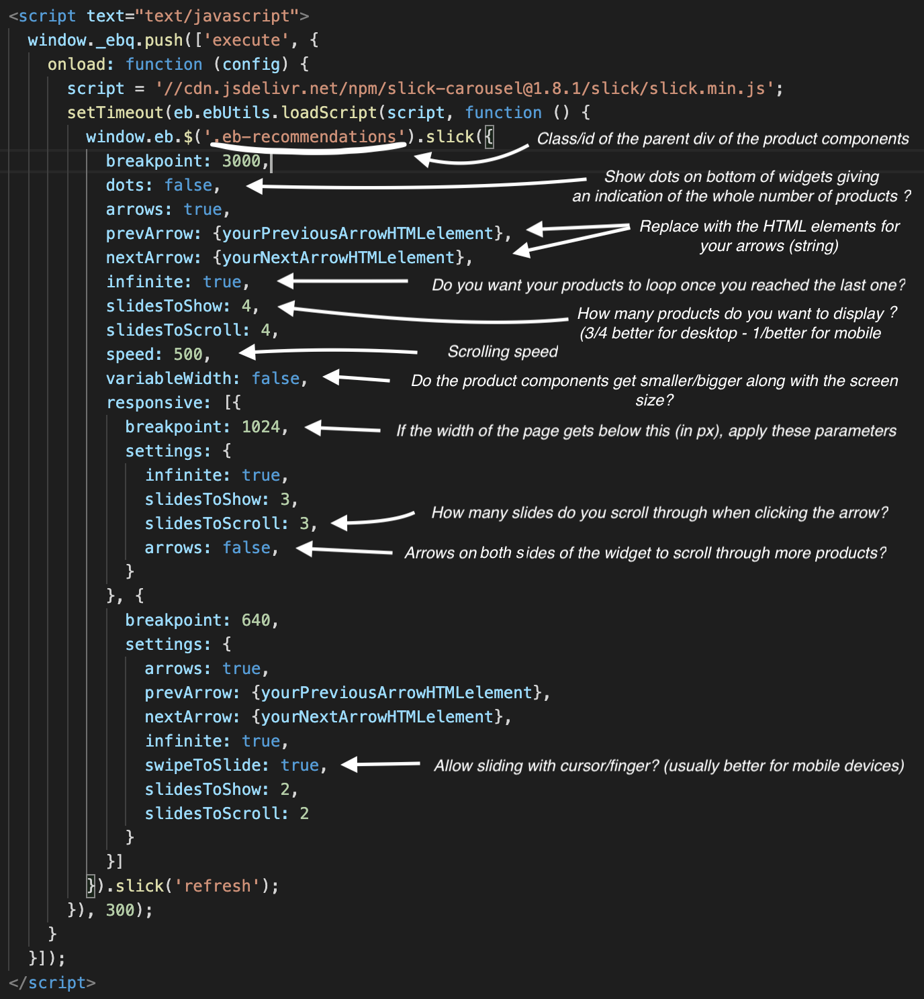

# xo-templates
*Default templates for use with Attraqt's XO console*

In the folder 'generic', you'll find the basic templates for a **4 products / 1 line basic widget**. 
This will need to be modified according to the **client's specific needs** (special pictogram to show if there's a sale? showing the discount percentage?).

Every line that is commented in the code, you need to **change to match your tenants** (link to styles.css, specific arrows, etc.)

Remember to double check that **all the ejs inserted variables match your product feed in the console**.
For example '<% recommendations[i].product.salesprice%>' might be '<% recommendations[i].product.discountprice%>'.

If you need differents features (no arrows, less products, etc), below is a **guide to slick's parameters**:

You can also visit https://kenwheeler.github.io/slick/#settings for the full list of paramaters.

Have fun!
